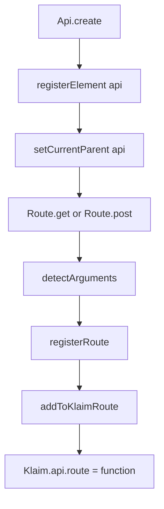

APIs and routes are the core abstraction in Klaim. An API defines a base URL and shared defaults. A route defines an HTTP method, a path fragment, optional headers, and optional route-specific behavior. Together they become functions on the exported `Klaim` object.

## What This Concept Solves

Without a declaration layer, most apps end up with a pile of small wrappers around `fetch()` that disagree on URL formatting, headers, and error behavior. Klaim centralizes that setup:

- `Api.create()` defines the host and top-level namespace.
- `Route.get()`, `Route.post()`, and the other static helpers define endpoints.
- `Registry` converts those definitions into callable functions.

The result is a runtime shape that matches how people think about an integration: `Klaim.github.repos.list`, not `"GET /repos"` buried in a helper string.

## How It Relates to Other Concepts

- [Groups and Hierarchy](/docs/groups-and-hierarchy) add nesting above or below APIs.
- [Request Lifecycle](/docs/request-lifecycle) explains what happens once you call a route.
- [Resilience and Control](/docs/resilience-and-control) covers the chainable settings inherited from `Element`.

## How It Works Internally

`Api.create()` in `src/core/Api.ts` does four important things:

1. Normalizes the API name with `toCamelCase()`.
2. Creates an `Api` instance that inherits from `Element`.
3. Registers that instance in `Registry.i.registerElement(api)`.
4. Sets the API as the current parent so routes defined in the callback register under it.

`Route.get()` and the other static helpers in `src/core/Route.ts` all delegate to `createRoute()`. That helper creates a `Route` instance, records its HTTP method, and calls `detectArguments()` to scan the path for bracket parameters like `[id]`.

When `Registry.registerRoute()` runs in `src/core/Registry.ts`, the route gets a `parent` path and is immediately added to the `Klaim` object by `addToKlaimRoute()`. That method uses `createRouteHandler()` from `src/core/Klaim.ts` so the route becomes a function instead of a plain object.



Two details are easy to miss:

- Path arguments are required only when the route path contains `[name]` segments.
- Pagination changes the call signature. If `withPagination()` has been set on a route, the first argument becomes the page or offset value.

## Basic Usage

```typescript
import { Api, Klaim, Route } from "klaim";

type User = {
  id: number;
  name: string;
};

Api.create("usersApi", "https://jsonplaceholder.typicode.com", () => {
  Route.get("listUsers", "/users");
  Route.get("getUser", "/users/[id]");
});

const users = await Klaim.usersApi.listUsers<User[]>();
const one = await Klaim.usersApi.getUser<User>({ id: 1 });
```

## Advanced Usage

This example combines route headers, a request body, and response validation on a non-GET route.

```typescript
import { Api, Klaim, Route } from "klaim";
import * as yup from "yup";

type PostInput = {
  title: string;
  body: string;
  userId: number;
};

type PostResponse = PostInput & {
  id: number;
};

const postSchema = yup.object({
  id: yup.number().required(),
  title: yup.string().required(),
  body: yup.string().required(),
  userId: yup.number().required(),
});

Api.create("posts", "https://jsonplaceholder.typicode.com", () => {
  Route.post("create", "/posts", {
    Authorization: "Bearer example-token",
  }).validate(postSchema);
});

const created = await Klaim.posts.create<PostResponse>(
  {},
  { title: "Hello", body: "Created with Klaim", userId: 1 }
);
```

<Callout type="warn">Route names and API names are always normalized with `toCamelCase()` from `src/tools/toCamelCase.ts`. If you declare `Route.get("get-user", "/users/[id]")`, the runtime property will be `Klaim.api.getUser`, not `get-user`. Missing `[id]` arguments throw `MissingArgumentError` before any network request is made.</Callout>

<Accordions>
<Accordion title="Why use declarative routes instead of hand-written fetch helpers?">
Klaim’s declaration model gives you a single source of truth for the base URL, route path, HTTP method, and runtime behavior. That makes it easy to audit what an integration does because the registration code mirrors the final runtime object. In `src/core/Registry.ts`, route declarations are converted directly into functions on `Klaim`, so the runtime stays close to the source. The trade-off is that type inference is weaker than a generated client because the object graph is created dynamically at runtime, not inferred from static declarations.
</Accordion>
<Accordion title="Why do route helpers return `Element` instead of a narrower route-specific type?">
The static route helpers in `src/core/Route.ts` return `Element`, which keeps the chaining surface consistent with `Api` and `Group`. That makes calls like `.withRetry()`, `.withTimeout()`, and `.before()` available from one shared base class. The cost is that route-specific methods such as `validate()` are only visible when you work with a `Route` instance directly rather than through the static return type. In practice, users usually chain `validate()` immediately on the static call site, and TypeScript still resolves it from the concrete class instance.
</Accordion>
</Accordions>

For full signatures, see [API](/docs/api-reference/api), [Route](/docs/api-reference/route), and [Klaim Runtime](/docs/api-reference/klaim).
