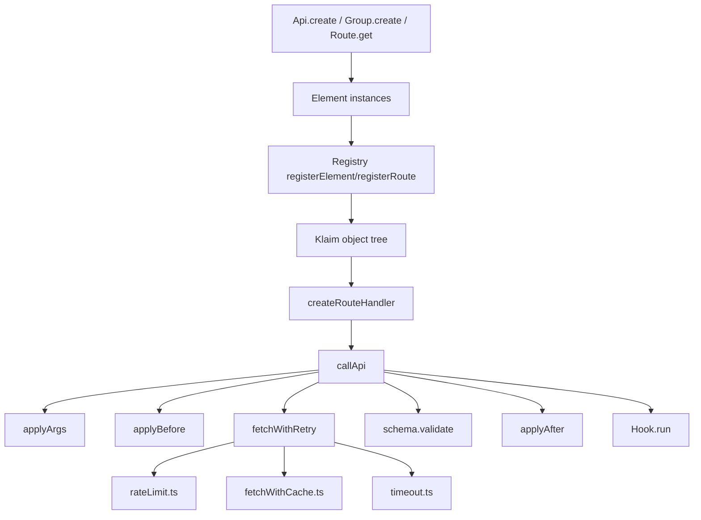
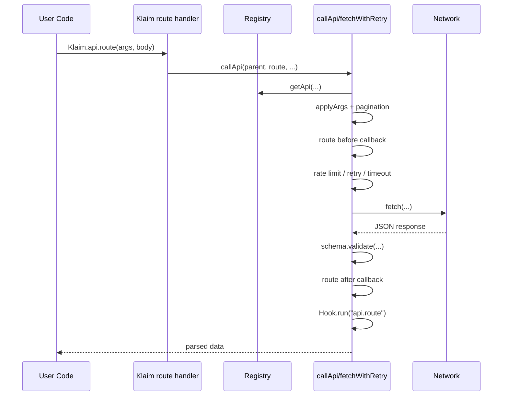

Klaim is built around a small set of runtime primitives: `Element` for shared configuration, `Api` and `Route` for declaration, `Group` for hierarchy, `Registry` for storage, and `Klaim` for execution. The codebase is compact, and almost all user-facing behavior flows through `src/core/Klaim.ts` and `src/core/Registry.ts`.



## Module Roles

`src/core/Element.ts` is the common base class. It owns the shared state for all declared elements: `name`, `url`, `headers`, callback slots, cache settings, retry settings, rate limiting, timeout, pagination, and validation metadata. Every other core class inherits these chainable configuration methods from `Element`.

`src/core/Api.ts` and `src/core/Route.ts` are declaration helpers. `Api.create()` creates an API node and temporarily changes the current parent in the registry so route declarations inside its callback register under that API. `Route.get()`, `Route.post()`, and the other static helpers create route nodes and register them under the current parent.

`src/core/Group.ts` adds hierarchy. A group can sit above APIs or above routes, depending on where it is declared. After `Group.create()` finishes its callback, group-level `withCache()`, `withRetry()`, `withTimeout()`, `before()`, `after()`, and `onCall()` copy settings down to already-registered children.

`src/core/Registry.ts` is the structural center of the library. It stores every element in `_elements`, tracks the current declaration parent in `_currentParent`, and mutates the exported `Klaim` object so that each route becomes a callable function at the correct nested property path.

`src/core/Klaim.ts` is the runtime center. `createRouteHandler()` builds the public callable functions placed on the `Klaim` object. `callApi()` resolves the owning API, fills route arguments, adds pagination query parameters when configured, applies middleware, executes the request with retry and timeout handling, validates the response, and then fires hook callbacks.

## Key Design Decisions

### Declarations are runtime-driven, not generated

Klaim does not generate a client from an OpenAPI schema or compile route definitions into files. Instead, it builds the client in memory by mutating the exported `Klaim` object at registration time. You can see this in `Registry.registerElement()` and `Registry.addToKlaimRoute()` inside `src/core/Registry.ts`.

Why this choice matters:

- You can declare APIs dynamically from normal application code.
- Nested groups are just nested object paths, so the runtime shape is easy to inspect.
- The trade-off is that type inference is limited compared with code generation, because the object shape is created at runtime.

### Configuration lives on elements

The `Element` base class in `src/core/Element.ts` keeps configuration local to each API, route, or group. That makes chainable declarations easy:

```typescript
Route.get("list", "/users")
  .withRetry(3)
  .withTimeout(2)
  .withRate({ limit: 10, duration: 60 });
```

This design keeps the public API small, but it also means the runtime has to decide which level wins when both API and route settings exist. In `fetchWithRetry()`, route-level retry, timeout, and rate limit take precedence; API-level values are fallback values.

### The middleware model is single-slot, not a chain

`Element.callbacks` stores one `before`, one `after`, and one `call` callback. There is no internal array and no middleware composition pipeline. `callApi()` invokes `route.callbacks.before` and `route.callbacks.after`; `fetchWithRetry()` invokes `route.callbacks.call` or, if it is missing, `api.callbacks.call`.

Why this is important:

- The behavior is predictable and cheap.
- Overwriting a callback is easy to reason about.
- You cannot register multiple `before` handlers for the same route and expect them all to run.

## Request Lifecycle



The lifecycle is deliberately linear:

1. Resolve the API owner for the route.
2. Build the final URL from `api.url` and `route.url`.
3. Replace `[param]` placeholders with values from `args`.
4. Add pagination query parameters if `route.pagination` is defined.
5. Build the fetch config with merged headers and a JSON body for non-GET requests.
6. Run the route-level `before` callback if present.
7. Execute the request through `fetchWithRetry()`, which also handles rate limits and timeouts.
8. Run schema validation if `route.schema` exists.
9. Run the route-level `after` callback if present.
10. Trigger `Hook.run()` for the route name.

## How the Pieces Fit Together

The usual declaration flow is:

1. `Api.create("service", "...", () => { ... })`
2. `Registry.setCurrentParent("service")`
3. `Route.get("list", "/items")`
4. `Registry.registerRoute(route)`
5. `Registry.addToKlaimRoute(route)`
6. `Klaim.service.list()` becomes callable

Groups introduce one extra parent path layer, but the principle stays the same. The registry always stores a dot-path such as `shop.catalog.products.list`, and the `Klaim` object mirrors that structure.

Important implementation details to keep in mind while reading the rest of the docs:

- Names are normalized with `toCamelCase()` from `src/tools/toCamelCase.ts`.
- URLs are normalized with `cleanUrl()` from `src/tools/cleanUrl.ts`, which trims only leading and trailing slashes.
- Cache storage is global and in-memory through the `Cache` singleton in `src/core/Cache.ts`.
- Rate limiting is global and in-memory through the `requestLogs` map in `src/tools/rateLimit.ts`.

From here, the most useful next pages are [APIs and Routes](/docs/api-and-routes), [Groups and Hierarchy](/docs/groups-and-hierarchy), and [Request Lifecycle](/docs/request-lifecycle).
