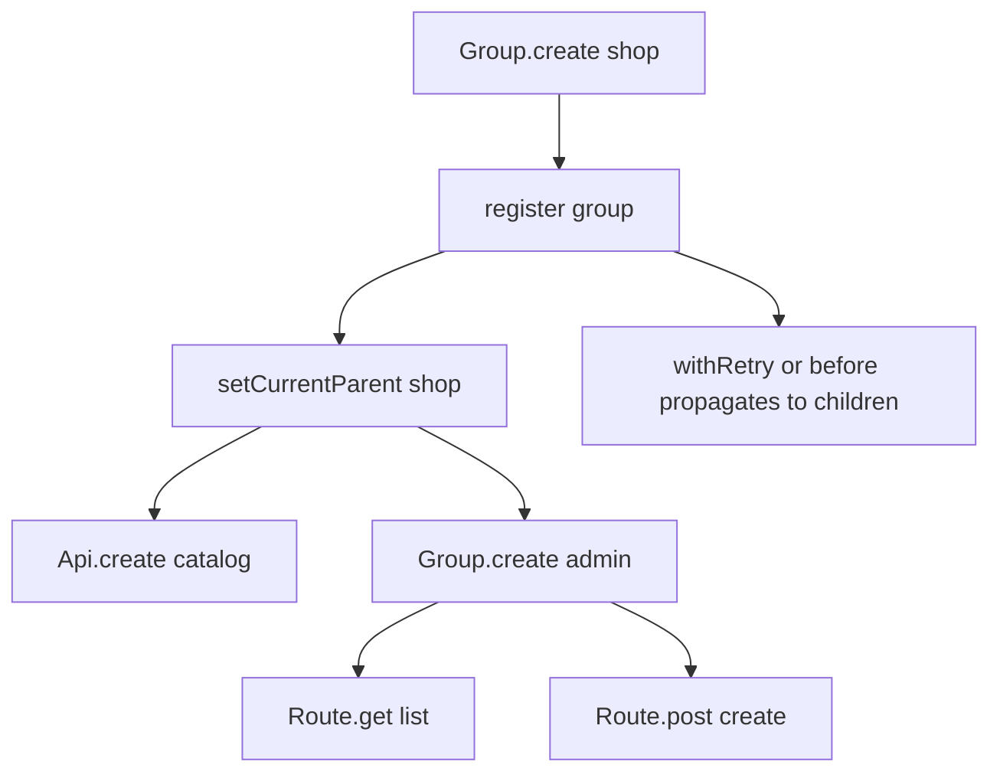

Groups are Klaim’s namespace and inheritance mechanism. They let you organize routes inside an API, organize multiple APIs under a shared namespace, and apply some settings to all children after registration.

## What a Group Is

A `Group` is an `Element` with `type: "group"` created by `Group.create()` in `src/core/Group.ts`. Unlike an API, it has no real base URL. Its job is structural:

- When declared inside an API callback, it creates a nested route namespace.
- When declared at the root level, it can hold multiple APIs.
- When declared inside another group, it creates deeper nesting.

Because `Registry.registerElement()` treats groups the same way it treats APIs for object creation, both appear as nested objects on `Klaim`.

## Why Groups Exist

Groups solve two practical problems:

- Large API surfaces become navigable because related routes live under one subtree.
- Shared behavior such as retries, timeout, or a request hook can be copied to all children in one place.

This is especially useful when a service has feature areas with different runtime needs, such as long-lived cached catalog routes and short-timeout admin routes.

## How Groups Work Internally

`Group.create()` in `src/core/Group.ts` computes a dot-path using the current parent, registers the group in the registry, switches the current parent to the new group path, runs the callback, and then restores the previous parent. That means every route or API declared inside the callback receives a parent path that includes the group.

After the callback, chainable methods such as `withCache()` and `before()` iterate through `Registry.i.getChildren(Registry.i.getFullPath(this))` and copy settings to children that do not already define their own values.



That propagation model explains an important behavior: group settings affect the elements created during the callback because the group methods run after registration is complete.

## Basic Usage

This example groups related routes under one API:

```typescript
import { Api, Group, Klaim, Route } from "klaim";

Api.create("store", "https://dummyjson.com", () => {
  Group.create("products", () => {
    Route.get("list", "/products");
    Route.get("getOne", "/products/[id]");
  }).withCache(60);
});

const products = await Klaim.store.products.list();
const phone = await Klaim.store.products.getOne({ id: 1 });
```

## Advanced Usage

This example groups multiple APIs at the root and gives them a shared timeout and route hook through the group.

```typescript
import { Api, Group, Hook, Klaim, Route } from "klaim";

Group.create("services", () => {
  Api.create("auth", "https://example.com/auth", () => {
    Route.post("login", "/login");
  });

  Api.create("billing", "https://example.com/billing", () => {
    Route.get("invoices", "/invoices");
  });
})
  .withTimeout(2, "Shared service timeout")
  .onCall(() => {
    console.log("A grouped service route is being called");
  });

Hook.subscribe("auth.login", () => {
  console.log("login completed");
});

await Klaim.services.auth.login({}, { email: "a@example.com", password: "secret" });
await Klaim.services.billing.invoices();
```

## Relationship to APIs and the Registry

Groups do not execute requests themselves. They exist to change the parent path that `Registry` uses and to copy configuration into children. APIs still provide the base URL. Routes still provide the HTTP method and path. The final call target always remains a route function attached somewhere under `Klaim`.

Because `Registry.getApi()` searches upward through the dot-path, nested routes can still find their owning API even when they live several group levels below it.

<Callout type="warn">`Group` inherits `withRate()` and `withPagination()` from `Element`, but `src/core/Group.ts` does not propagate those settings and `src/core/Klaim.ts` only reads rate limits from APIs and routes and pagination from routes. In other words, route groups are a good fit for cache, retry, timeout, and callbacks, but not for shared pagination or shared rate limiting in the current implementation.</Callout>

<Accordions>
<Accordion title="Why use groups instead of flat route names?">
Flat route names scale poorly once an API has more than a dozen operations because semantic boundaries disappear. A grouped tree such as `Klaim.store.products.list()` expresses intent more clearly than `Klaim.storeListProducts()`, and the registry already stores dot-paths internally, so the grouping model is cheap to maintain. The trade-off is that dynamic object traversal becomes deeper, which can make ad hoc introspection slightly more awkward. For most real integrations, the readability gain is worth that extra nesting.
</Accordion>
<Accordion title="What are the limits of group-level inheritance?">
Group inheritance is copy-based, not live composition. When you call `.withCache()` or `.before()` on a group, `src/core/Group.ts` walks the already-created children and fills in missing values, but it does not keep a stack of inherited middleware or recompute descendants later. That makes the implementation simple and avoids complicated merge logic, but it also means one child callback can replace another instead of forming a pipeline. If you need truly layered middleware semantics, you have to model them yourself inside one callback function.
</Accordion>
</Accordions>

The next useful page is [Request Lifecycle](/docs/request-lifecycle), which shows what happens after a grouped route is actually invoked.
