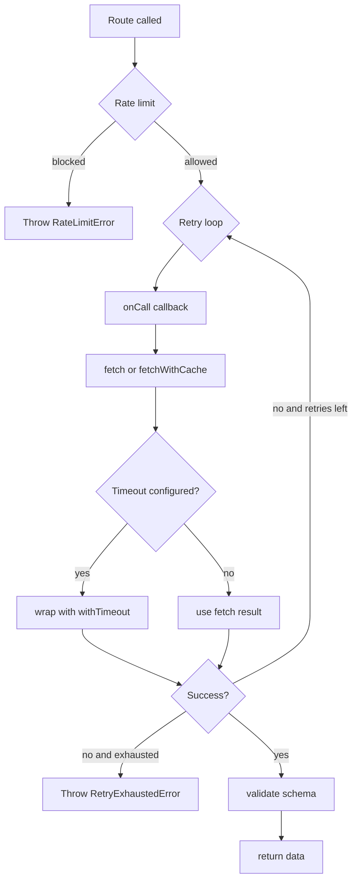

Klaim’s runtime controls live mostly on `Element` and are enforced inside `src/core/Klaim.ts` and `src/tools/*`. These options are what turn a plain route declaration into an integration client that can tolerate slow networks, repeated calls, and contract drift.

## What This Concept Covers

The relevant chainable methods are:

- `withCache(duration?: number)`
- `withRetry(maxRetries?: number)`
- `withRate(config?: Partial<IRateLimitConfig>)`
- `withTimeout(duration?: number, message?: string)`
- `withPagination(config?: IPaginationConfig)`
- `validate(schema)`

Each one solves a different failure mode:

- Cache reduces repeated network work.
- Retry absorbs transient failures.
- Rate limiting protects your caller or upstream service.
- Timeout prevents hung requests from lingering forever.
- Pagination standardizes page and limit parameters.
- Validation catches schema drift before bad data leaks further into your app.

## Internal Behavior

`fetchWithRetry()` in `src/core/Klaim.ts` is where retry, timeout, cache, and rate limiting come together. The function computes:

- `withCache` from `api.cache || route.cache`
- `maxRetries` from `route.retry || api.retry || 0`
- `timeoutCfg` from `route.timeout || api.timeout`

Then it checks rate limits in this order:

1. Use the route-level limit if `route.rate` exists.
2. Otherwise, use the API-level limit if `api.rate` exists.

Pagination is handled earlier in `callApi()`. If `route.pagination` exists and a numeric first argument is provided, Klaim appends the configured `pageParam` and `limitParam` query parameters.

Validation is handled after the network request by calling `route.schema.validate(response)`.



## Basic Usage

```typescript
import { Api, Klaim, Route } from "klaim";

Api.create("catalog", "https://dummyjson.com", () => {
  Route.get("listProducts", "/products")
    .withCache(60)
    .withRetry(2)
    .withTimeout(3, "Catalog request took too long");
});

const products = await Klaim.catalog.listProducts();
```

## Advanced Usage

This example shows pagination, validation, rate limiting, and a custom timeout together on one route.

```typescript
import { Api, Klaim, Route } from "klaim";
import * as yup from "yup";

const pokemonSchema = yup.object({
  results: yup.array(
    yup.object({
      name: yup.string().required(),
    })
  ).required(),
});

Api.create("pokemon", "https://pokeapi.co/api/v2", () => {
  Route.get("list", "/pokemon")
    .withPagination({ pageParam: "offset", limitParam: "limit", limit: 3 })
    .withRate({ limit: 5, duration: 10 })
    .withTimeout(2)
    .validate(pokemonSchema);
});

const firstPage = await Klaim.pokemon.list(0);
const nextPage = await Klaim.pokemon.list(6);
```

## How It Relates to Other Concepts

- [Request Lifecycle](/docs/request-lifecycle) shows where these controls run.
- [Types](/docs/types) documents `IPaginationConfig`, `IRateLimitConfig`, and `ITimeoutConfig`.
- [Guide: Advanced Runtime Patterns](/docs/guides/advanced-runtime-patterns) shows how to combine these controls in an app-level setup.

<Callout type="warn">Cache behavior has an implementation detail worth knowing. In `src/core/Klaim.ts`, cache enablement checks `api.cache || route.cache`, but `fetchWithCache()` receives `api.cache` as the TTL source. That means API-level cache durations are honored, while route-level or group-propagated cache durations enable caching but do not currently pass their own TTL to the cache layer. Also note that paginated routes reinterpret the first function argument as the page or offset number, so `Klaim.api.route({ id: 1 })` becomes invalid once `withPagination()` is enabled.</Callout>

<Accordions>
<Accordion title="When should configuration live at the API level versus the route level?">
API-level settings are best when every endpoint under one host should behave the same way, such as a shared timeout or rate budget. Route-level settings are better when one endpoint is much slower, more sensitive, or more expensive than the others. Klaim’s precedence rules favor route settings first in `fetchWithRetry()`, so a route can override an API default cleanly. The trade-off is that mixed strategies need discipline, because reading one route in isolation may not reveal which fallback behavior still comes from the parent API.
</Accordion>
<Accordion title="What do retries buy you, and what do they risk?">
Retries help with transient network failures and flaky upstreams, and Klaim’s exponential backoff with jitter in `src/core/Klaim.ts` is a reasonable default for that case. They do not make unsafe operations safe: retrying a non-idempotent `POST` can duplicate side effects if the upstream processed the first request before the network failed. Because the library does not inspect status codes or idempotency hints, the decision to retry is purely transport-oriented. For create or mutation endpoints, keep retry counts conservative and consider moving important deduplication logic to the server side.
</Accordion>
</Accordions>

For exact method signatures, see [API Reference: Route](/docs/api-reference/route) and [API Reference: Api](/docs/api-reference/api).
