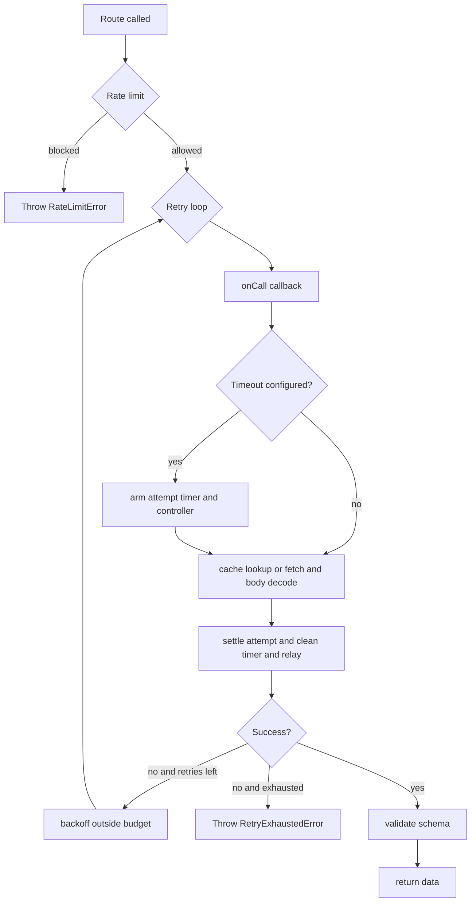

Klaim’s runtime controls live mostly on `Element` and are enforced inside `src/core/Klaim.ts` and `src/tools/*`. These options are what turn a plain route declaration into an integration client that can tolerate slow networks, repeated calls, and contract drift.

## What This Concept Covers

The relevant chainable methods are:

- `withCache(duration?: number)`
- `withRetry(maxRetries?: number)`
- `withRate(config?: Partial<IRateLimitConfig>)`
- `withTimeout(duration?: number, message?: string)`
- `withPagination(config?: IPaginationConfig)`
- `validate(schema)`

Each one solves a different failure mode:

- Cache reduces repeated network work.
- Retry absorbs transient failures.
- Rate limiting protects your caller or upstream service.
- Timeout prevents hung requests from lingering forever.
- Pagination standardizes page and limit parameters.
- Validation catches schema drift before bad data leaks further into your app.

## Internal Behavior

`fetchWithRetry()` in `src/core/Klaim.ts` is where retry, timeout, cache, and rate limiting come together. The function computes:

- Cache duration from `route.cache || api.cache`, captured after `before` and before retries, then converted once from seconds to milliseconds
- `maxRetries` from `route.retry || api.retry || 0`
- `timeoutCfg` from `route.timeout || api.timeout`

Then it checks rate limits in this order:

1. Use the route-level limit if `route.rate` exists.
2. Otherwise, use the API-level limit if `api.rate` exists.

Pagination is handled earlier in `callApi()`. If `route.pagination` exists and a numeric first argument is provided, Klaim appends the configured `pageParam` and `limitParam` query parameters.

Validation is handled after the network request by calling `route.schema.validate(response)`.


```mermaid
flowchart TD
  A[Route called] --> B{Rate limit}
  B -->|blocked| C[Throw RateLimitError]
  B -->|allowed| D{Retry loop}
  D --> E[onCall callback]
  E --> G{Timeout configured?}
  G -->|yes| H[arm attempt timer and controller]
  G -->|no| F[cache lookup or fetch and body decode]
  H --> F
  F --> I[settle attempt and clean timer and relay]
  I --> J{Success?}
  J -->|no and retries left| N[backoff outside budget]
  N --> D
  J -->|no and exhausted| K[Throw RetryExhaustedError]
  J -->|yes| L[validate schema]
  L --> M[return data]
```

## Timeout boundaries and cancellation

Timeout is off by default. Calling `withTimeout()` enables a five-second budget; durations are seconds and route settings take precedence over API settings. Every retry gets a new timer and, when available, a new `AbortController`. The attempt is armed after `before`, the rate check and `onCall`, but **before cache lookup**. Cache hits may allocate a timer/controller, then clean them without fetch or abort.

The budget includes cache work, fetch, headers, body reading and decoding. Validation, `after`, `Hook` and retry backoff are outside it. The first observed terminal outcome wins: timeout records one `TimeoutError` before requesting abort, so a transport `AbortError` cannot replace it. Without retries the error is returned directly; exhausted retries retain the final error as `RetryExhaustedError.cause`.

Guards on both cached and uncached paths stop a late response before any body access, and stop an already-started body read before cache insertion or success callbacks. A losing rejection is observed. Timers and caller-signal relays are cleaned on success, rejection, timeout and synchronous setup failure; cleanup neither waits for a non-cooperative request nor aborts a successful one.

`before` can supply `config.signal`: timeout-enabled attempts relay pre-existing or later cancellation with its original reason; timeout-disabled requests keep the original signal. Caller abort does not become a new terminal policy and does not interrupt retry backoff. A transport ignoring caller abort can still succeed before the timeout. The source helper `withTimeout(promise, config)` remains a logical wrapper for an already-started promise; it cannot retroactively attach a transport signal.

Without `AbortController`, logical timeout and late-result guards still apply, but network closure is not guaranteed. Expiration depends on event-loop progress and cannot preempt synchronous decoding. Server-side effects already performed cannot be reversed. Tests prove native Node stream closure for blocked headers and open bodies, with and without cache; Bun, Deno and browser transport cancellation remain unverified.

## Basic Usage

```typescript
import { Api, Klaim, Route } from "klaim";

Api.create("catalog", "https://dummyjson.com", () => {
  Route.get("listProducts", "/products")
    .withCache(60)
    .withRetry(2)
    .withTimeout(3, "Catalog request took too long");
});

const products = await Klaim.catalog.listProducts();
```

## Advanced Usage

This example shows pagination, validation, rate limiting, and a custom timeout together on one route.

```typescript
import { Api, Klaim, Route } from "klaim";
import * as yup from "yup";

const pokemonSchema = yup.object({
  results: yup.array(
    yup.object({
      name: yup.string().required(),
    })
  ).required(),
});

Api.create("pokemon", "https://pokeapi.co/api/v2", () => {
  Route.get("list", "/pokemon")
    .withPagination({ pageParam: "offset", limitParam: "limit", limit: 3 })
    .withRate({ limit: 5, duration: 10 })
    .withTimeout(2)
    .validate(pokemonSchema);
});

const firstPage = await Klaim.pokemon.list(0);
const nextPage = await Klaim.pokemon.list(6);
```

## How It Relates to Other Concepts

- [Request Lifecycle](/docs/request-lifecycle) shows where these controls run.
- [Types](/docs/types) documents `IPaginationConfig`, `IRateLimitConfig`, and `ITimeoutConfig`.
- [Guide: Advanced Runtime Patterns](/docs/guides/advanced-runtime-patterns) shows how to combine these controls in an app-level setup.

`withCache()` defaults to 20 seconds. A truthy route duration takes precedence over the API duration, including a duration copied from a group. Route values `false`, `0`, `-0`, or `NaN` allow API fallback; if both values are falsy, the request never accesses the cache. Positive fractions are kept without rounding. Negative durations, infinities, and multiplication overflow remain unbounded, without new validation. Group propagation remains limited to existing direct children with falsy cache settings.

Expiration starts when the decoded response is inserted, not when the request starts. An entry is valid at the exact expiry timestamp and expires strictly after it; reads do not extend its lifetime. Concurrent misses still make separate fetches, and the last successful insertion wins for the same key. `Cache.i.clear()` invalidates all entries.

Compatibility note: route durations now actually expire, and API durations now use seconds rather than the previous accidental milliseconds. Remove any application workaround that compensated for these bugs. Klaim's new in-memory keys isolate route paths, effective TTLs, and response policies; aliases no longer share entries just because their URL/config match. Only `signal` is excluded from request-config identity. There is no persistent migration. See [Cache](/docs/api-reference/cache) for the distinction from the millisecond `Cache.i.set()` API.

<Callout type="warn">Paginated routes reinterpret the first function argument as the page or offset number, so `Klaim.api.route({ id: 1 })` becomes invalid once `withPagination()` is enabled.</Callout>

<Accordions>
<Accordion title="When should configuration live at the API level versus the route level?">
API-level settings are best when every endpoint under one host should behave the same way, such as a shared timeout or rate budget. Route-level settings are better when one endpoint is much slower, more sensitive, or more expensive than the others. Klaim’s precedence rules favor route settings first in `fetchWithRetry()`, so a route can override an API default cleanly. The trade-off is that mixed strategies need discipline, because reading one route in isolation may not reveal which fallback behavior still comes from the parent API.
</Accordion>
<Accordion title="What do retries buy you, and what do they risk?">
Retries help with transient network failures and flaky upstreams, and Klaim’s exponential backoff with jitter in `src/core/Klaim.ts` is a reasonable default for that case. They do not make unsafe operations safe: retrying a non-idempotent `POST` can duplicate side effects if the upstream processed the first request before the network failed. Because the library does not inspect status codes or idempotency hints, the decision to retry is purely transport-oriented. For create or mutation endpoints, keep retry counts conservative and consider moving important deduplication logic to the server side.
</Accordion>
</Accordions>

For exact method signatures, see [API Reference: Route](/docs/api-reference/route) and [API Reference: Api](/docs/api-reference/api).
